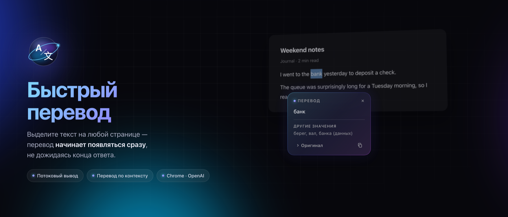
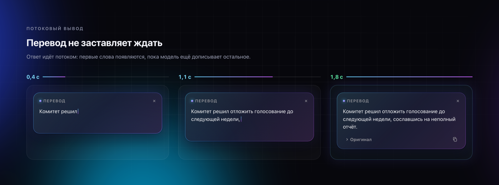
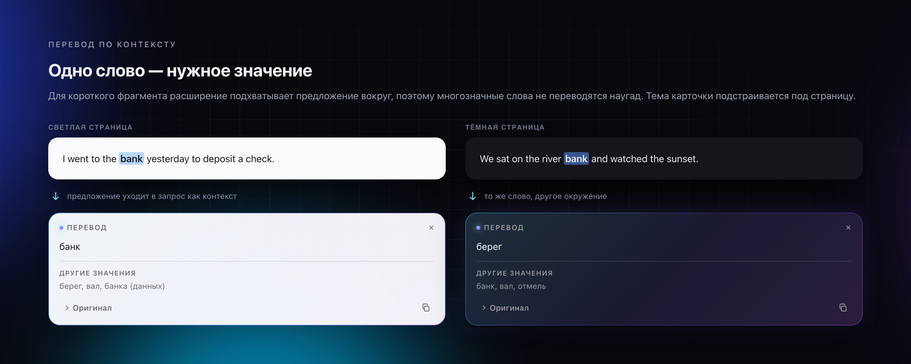
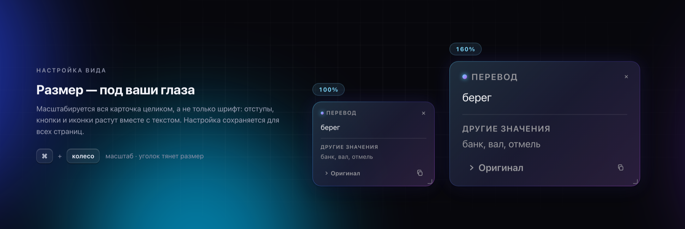
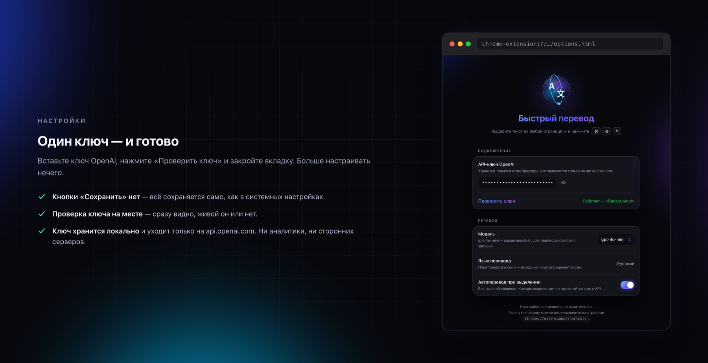

[Русский](README.md) · **English**

[**Download the latest release**](https://github.com/StrangerOfDawah/quick-translate/releases/latest) · Chrome · Manifest V3 · OpenAI API

> The interface is in Russian and the extension translates **into** Russian — the source language is detected automatically. To target another language, change `targetLang` in `DEFAULTS` inside `background.js` and `options.js`.

 

## No waiting for the translation

The response streams over SSE: the first words show up in about half a second while the model is still writing the rest. On a long paragraph that's the difference between staring at a spinner and reading right away.

Close the card mid-translation and the request aborts — unfinished tokens aren't billed.

 

## One word, the right meaning

Selected a single word? The extension picks up the surrounding sentence and asks for the translation that fits *that* sentence. Other common meanings are listed underneath, in case you needed a different one.

The card lives in a Shadow DOM, so site styles can't break it, and it follows the page's light or dark theme.

 

## Sized for your eyes

The whole card scales, not just the font — padding, buttons and icons grow with the text. The corner grip resizes it, a double-click resets everything. The setting persists across every page.

 

## One key and you're done

 

## Install

1. Download the archive from the [**Releases**](https://github.com/StrangerOfDawah/quick-translate/releases/latest) page and unpack it
2. Open `chrome://extensions`
3. Turn on **Developer mode** — the toggle in the top right
4. Click **Load unpacked** and select the unpacked folder

Don't delete or rename the folder afterwards — Chrome loads the extension straight from it. Put it somewhere permanent.

The extension isn't on the Chrome Web Store, hence the manual install. Chrome will remind you about developer mode on startup; that's normal for manually installed extensions.

 

## OpenAI key

You need an OpenAI API key. This is **not** a ChatGPT Plus subscription — that gives no programmatic access. The API is billed separately, per use.

1. Create a key at [platform.openai.com/api-keys](https://platform.openai.com/api-keys) and top up your balance
2. Click the extension icon to open its settings
3. Paste the key and hit **Проверить ключ** (Test key)

**On cost.** The default model is `gpt-4o-mini`, the cheapest one. A paragraph costs hundredths of a cent, and $5 of credit lasts a long time. Track spending at [platform.openai.com/usage](https://platform.openai.com/usage), where you can also set a monthly limit.

 

## Usage

| Method | How |
| --- | --- |
| Keyboard shortcut | Select text → <kbd>⌘</kbd><kbd>⇧</kbd><kbd>Y</kbd> (Mac) or <kbd>Ctrl</kbd><kbd>⇧</kbd><kbd>Y</kbd> (Windows) |
| Context menu | Select text → right-click → «Перевести на русский» |
| Automatic | Enable the toggle in settings — translates on any mouse selection |
| Scale | <kbd>⌘</kbd>/<kbd>Ctrl</kbd> + scroll over the card |

In the card: the icon button copies the translation, «Оригинал» expands the source text. Close it with <kbd>Esc</kbd>, the ×, a click outside, or by scrolling.

You can rebind the shortcut at `chrome://extensions/shortcuts`. If it doesn't work right away, check there that the combination is actually assigned — Chrome silently leaves the field empty when another extension already claims it.

 

## How it works

| File | Purpose |
| --- | --- |
| `manifest.json` | Manifest, permissions, keyboard shortcut |
| `background.js` | Service worker: context menu, OpenAI streaming, translation cache |
| `content.js` | On-page card, context extraction, scale and size |
| `options.html` · `options.js` | Settings page |
| `icons/` | Icons, 16–128 |

The key is stored in `chrome.storage.local` and only ever sent to `api.openai.com`. No analytics, no third-party servers.

Repeat translations of the same fragment come from an in-memory cache in the service worker (last 200) and cost nothing. Selections are capped at 5000 characters so an accidental <kbd>⌘</kbd><kbd>A</kbd> doesn't send a whole page to the API.

 

## Limitations

- Works only where Chrome lets extensions run scripts: the card won't appear on `chrome://` pages, the Chrome Web Store, or other extensions' pages
- The target language is fixed to Russian on purpose — the value goes straight into the system prompt, so there's no free-text field
- After editing the code, press Reload on the extension card in `chrome://extensions` and refresh open tabs

 

## License

MIT — see [LICENSE](LICENSE).
