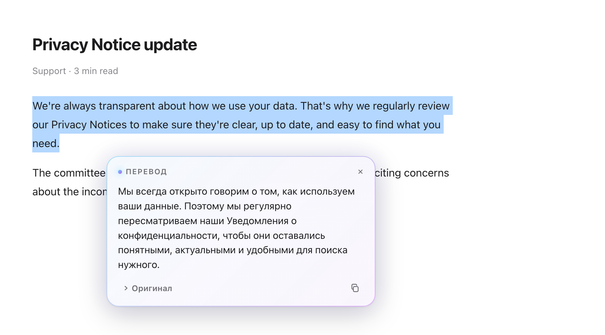
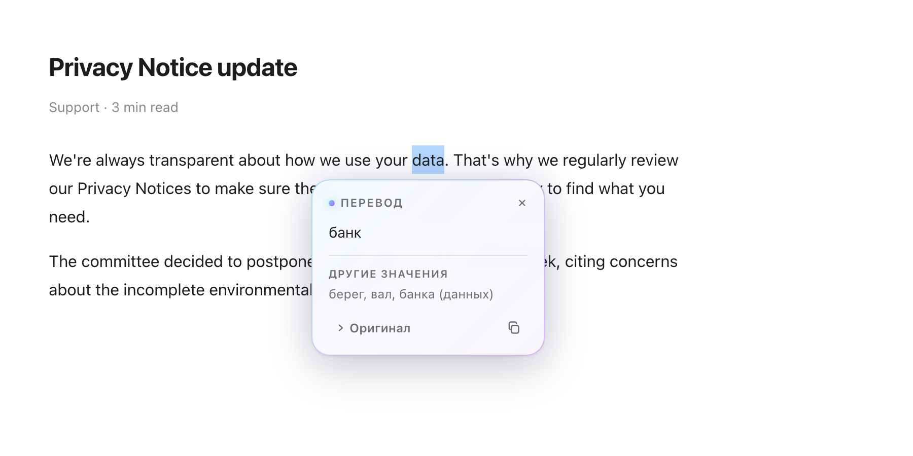
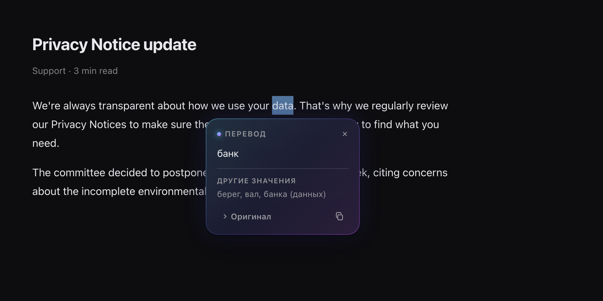
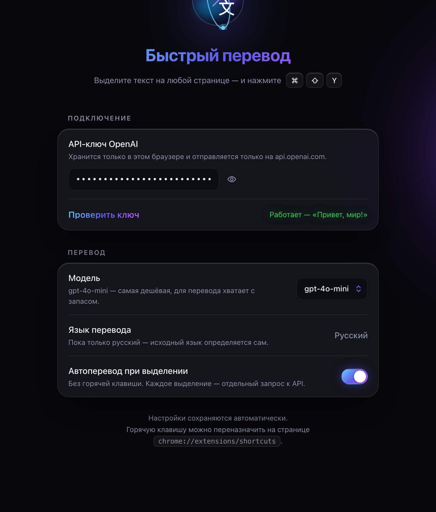

**Русский** · [English](README.en.md)

# Быстрый перевод

**Выделите текст на любой странице — получите перевод на русский.**
Расширение Chrome на Manifest V3, переводит через OpenAI API.

[**Скачать последнюю версию**](https://github.com/StrangerOfDawah/quick-translate/releases/latest)

 

 

## Возможности

**Перевод появляется по мере генерации.** Ответ идёт потоком (SSE), первые слова видны примерно через полсекунды — не нужно ждать, пока модель допишет весь абзац.

**Отдельные слова переводятся с учётом предложения.** Если выделить одно слово, расширение само подхватит предложение вокруг него и попросит перевод именно в этом значении. Под основным переводом покажет остальные частые значения.

В `I went to the **bank** to deposit a check` вернёт «банк», а в `We sat on the river **bank**` — «берег».

**Тёмная тема** подхватывается автоматически.

**Размер настраивается.** `Cmd`/`Ctrl` + колесо над карточкой меняет масштаб, уголок справа снизу тянет размер, двойной клик по уголку сбрасывает. Настройки сохраняются для всех страниц.

**Карточка не ломается о стили сайта** — живёт в Shadow DOM, поэтому выглядит одинаково везде.

 

## Установка

1. Скачайте архив со страницы [**Releases**](https://github.com/StrangerOfDawah/quick-translate/releases/latest) и распакуйте
2. Откройте `chrome://extensions`
3. Включите **Режим разработчика** — тумблер справа сверху
4. Нажмите **Загрузить распакованное расширение** и выберите распакованную папку

Папку после этого нельзя удалять или переименовывать — Chrome загружает расширение прямо из неё. Положите её туда, где она останется надолго.

Расширения нет в Chrome Web Store, поэтому ставится оно так. Chrome будет показывать напоминание про режим разработчика при запуске — это нормально для расширений, установленных вручную.

 

## Настройка

Нужен ключ OpenAI API. Это **не** подписка ChatGPT Plus — она программного доступа не даёт, ключ оплачивается отдельно по факту использования.

1. Заведите ключ на [platform.openai.com/api-keys](https://platform.openai.com/api-keys) и пополните баланс
2. Нажмите на иконку расширения — откроются настройки
3. Вставьте ключ и нажмите **Проверить ключ**

Кнопки «Сохранить» нет — всё сохраняется само.

**Про деньги.** Модель по умолчанию `gpt-4o-mini` — самая дешёвая. Абзац стоит сотые доли цента, $5 на балансе хватает надолго. Расход видно на [platform.openai.com/usage](https://platform.openai.com/usage), там же можно поставить месячный лимит.

 

## Как пользоваться

| Способ | Как |
| --- | --- |
| Горячая клавиша | Выделить текст → <kbd>⌘</kbd><kbd>⇧</kbd><kbd>Y</kbd> (Mac) или <kbd>Ctrl</kbd><kbd>⇧</kbd><kbd>Y</kbd> (Windows) |
| Контекстное меню | Выделить текст → правый клик → «Перевести на русский» |
| Автоматически | Включить тумблер в настройках — переводит по любому выделению мышью |

В карточке: кнопка-иконка копирует перевод, «Оригинал» разворачивает исходный текст. Закрыть — <kbd>Esc</kbd>, крестик, клик мимо или скролл.

Горячую клавишу можно переназначить на `chrome://extensions/shortcuts`. Если она не сработала сразу — проверьте там, что комбинация назначена: Chrome молча оставляет поле пустым, когда сочетание уже занято другим расширением.

 

## Устройство

| Файл | Назначение |
| --- | --- |
| `manifest.json` | Манифест, разрешения, горячая клавиша |
| `background.js` | Service worker: контекстное меню, стриминг из OpenAI, кэш переводов |
| `content.js` | Карточка на странице, разбор контекста, масштаб и размер |
| `options.html` · `options.js` | Страница настроек |
| `icons/` | Иконки 16–128 |

Ключ хранится в `chrome.storage.local` и уходит только на `api.openai.com`. Никакой аналитики и сторонних серверов.

Повторные переводы одного фрагмента берутся из кэша в памяти service worker (200 последних) и не тратят токены. Если закрыть карточку посреди перевода, запрос обрывается — недогенерированное не оплачивается.

Ограничение на длину — 5000 символов за раз, чтобы случайный <kbd>⌘</kbd><kbd>A</kbd> не ушёл в API целой страницей. Меняется константой `MAX_CHARS` в `content.js`.

 

## Ограничения

- Работает только там, где Chrome разрешает расширениям выполнять скрипты: на `chrome://`, в Chrome Web Store и на страницах других расширений карточка не появится
- Язык перевода зафиксирован русским — значение подставляется в системный промпт, поэтому свободного ввода нет намеренно. Меняется в `DEFAULTS` в `background.js` и `options.js`
- После правок кода нужно нажать «Обновить» на карточке расширения в `chrome://extensions` и перезагрузить открытые вкладки

 

## Лицензия

MIT — см. [LICENSE](LICENSE).
